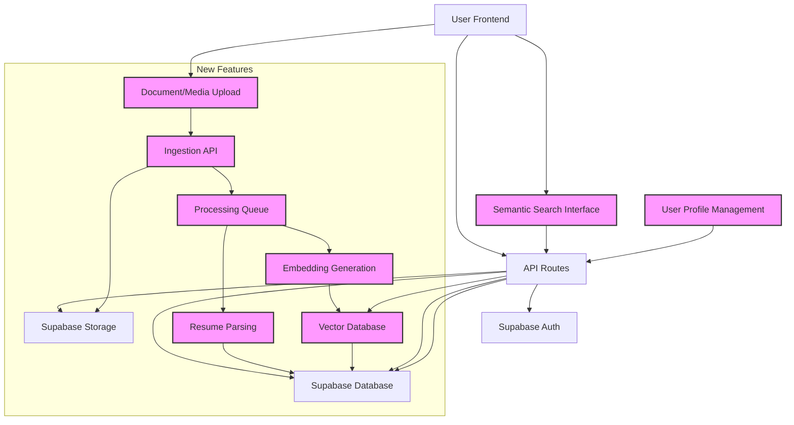

# System Architecture Design for Voiceloophr Enhancements

This document outlines the proposed system architecture for integrating semantic search capabilities for documents and media files, and a robust resume parsing feature with user profile auto-completion into the existing Voiceloophr platform.

## 1. Overview of Proposed Architecture

The enhanced Voiceloophr architecture will introduce a new data pipeline for document and media ingestion, processing, and semantic indexing. This pipeline will leverage Supabase for both raw file storage and metadata/embedding storage, and integrate with external AI/ML services for embedding generation and advanced parsing. The existing Next.js frontend and API routes will be extended to support these new functionalities.



## 2. Component Breakdown and Responsibilities

### 2.1. Frontend (Next.js)

-   **Document/Media Upload Interface**: A new modal accessible via a navbar icon (e.g., a single person icon for profile/resume management) will allow users to upload documents and media files.
-   **Semantic Search Interface**: Integration into the existing chat or a dedicated search page, allowing users to input natural language queries for document/media retrieval.
-   **User Profile Template**: An extended user profile section where parsed resume data can be displayed and edited.

### 2.2. API Routes (Next.js Backend)

-   **Ingestion API**: A new API endpoint (`/api/ingest`) to handle file uploads from the frontend. This API will store the raw file in Supabase Storage and trigger the processing queue.
-   **Semantic Search API**: An API endpoint (`/api/search`) that receives natural language queries, converts them into embeddings, queries the vector database, and returns relevant document/media metadata.
-   **Resume Processing API**: An API endpoint (`/api/process-resume`) that triggers the resume parsing workflow and updates the user's profile in the Supabase database.

### 2.3. Supabase Integration

-   **Supabase Storage**: Will be used as the primary storage for raw document and media files (PDFs, WAVs, MP4s). Buckets will be organized for different content types (e.g., `resumes`, `audio_recordings`, `general_documents`).
-   **Supabase Database (PostgreSQL)**: Will store metadata about the uploaded files (e.g., file name, type, upload date, associated user ID). It will also house the user profile templates and the `pgvector` extension for storing and querying embeddings.
-   **Supabase Functions/Edge Functions**: Can be used to trigger asynchronous processing tasks (e.g., sending files to embedding generation services, initiating resume parsing) after a file upload.

### 2.4. Processing and AI Services

-   **Processing Queue**: A mechanism (e.g., a message queue, or simply direct function calls from Supabase Functions) to manage the asynchronous processing of uploaded files. This is crucial for handling potentially long-running tasks like transcription and embedding generation.
-   **Embedding Generation Service**: Responsible for converting various content types into vector embeddings:
    -   **Text Documents (PDFs)**: Extract text content (e.g., using a library like `pdf.js` or a cloud OCR service), then use a text embedding model (e.g., OpenAI Embeddings, Hugging Face `sentence-transformers`).
    -   **Audio Files (WAVs)**: Transcribe audio to text using a speech-to-text model (e.g., OpenAI Whisper). Once transcribed, generate text embeddings.
    -   **Video Files (MP4s)**: Extract audio for transcription and/or keyframes for image analysis. Generate embeddings from the transcribed text and/or visual features. For advanced video understanding, a dedicated video embedding model (e.g., Twelve Labs, CLIP-based approaches) could be used.
-   **Vector Database**: The `pgvector` extension within Supabase PostgreSQL is a strong candidate for storing the generated embeddings. This allows for efficient similarity searches directly within the existing database infrastructure.
-   **Resume Parsing Service**: A specialized service (can be a separate microservice or integrated within the Next.js backend) that takes a resume (text or PDF) and extracts structured information (e.g., name, contact, experience, education, skills). This service will then map the extracted data to the user's profile template in the Supabase database.

## 3. Workflow Details

### 3.1. Document/Media Ingestion Workflow

1.  **User Upload**: User uploads a file (resume, audio, document) via the frontend modal.
2.  **API Endpoint**: Frontend sends the file to the `/api/ingest` Next.js API route.
3.  **Storage**: The Ingestion API uploads the raw file to the appropriate bucket in Supabase Storage.
4.  **Metadata Storage**: The API saves basic file metadata (filename, user ID, storage path, status) to a `documents` table in Supabase PostgreSQL.
5.  **Trigger Processing**: The Ingestion API (or a Supabase Storage trigger) sends a message to the Processing Queue (e.g., invokes a Supabase Edge Function).
6.  **Content Extraction & Embedding**: The processing function:
    -   Determines file type.
    -   For PDFs: Extracts text.
    -   For Audio/Video: Transcribes audio to text.
    -   Generates embeddings from the extracted text/features using the Embedding Generation Service.
7.  **Vector Storage**: The generated embeddings are stored in the `embeddings` table (linked to the `documents` table) in Supabase PostgreSQL (using `pgvector`).

### 3.2. Semantic Search Workflow

1.  **User Query**: User enters a natural language query (e.g., 


"Find resumes of software engineers with 5+ years of experience in Python") in the frontend.
2.  **API Call**: Frontend sends the query to the `/api/search` Next.js API route.
3.  **Query Embedding**: The API route sends the query to the Embedding Generation Service to get its vector embedding.
4.  **Vector Search**: The API route queries the `embeddings` table in Supabase PostgreSQL (using `pgvector`) to find the most semantically similar document embeddings.
5.  **Result Retrieval**: The API retrieves the metadata of the top-k similar documents from the `documents` table.
6.  **Display Results**: Frontend displays the relevant documents/media files to the user.

### 3.3. Resume Parsing and Profile Completion Workflow

1.  **User Upload**: User uploads a resume (PDF or text) via the dedicated modal.
2.  **API Endpoint**: Frontend sends the resume to the `/api/process-resume` Next.js API route.
3.  **Storage**: The API uploads the raw resume file to the `resumes` bucket in Supabase Storage.
4.  **Trigger Parsing**: The API (or a Supabase Storage trigger) invokes the Resume Parsing Service.
5.  **Data Extraction**: The Resume Parsing Service extracts structured data (e.g., name, contact, experience, education, skills) from the resume.
6.  **Profile Update**: The extracted data is used to populate or update the user's profile template in the `user_profiles` table in Supabase PostgreSQL.
7.  **Confirmation/Display**: The frontend displays the updated user profile to the user for review and confirmation.

## 4. Database Schema Considerations

### `documents` table:

```sql
CREATE TABLE documents (
    id UUID PRIMARY KEY DEFAULT uuid_generate_v4(),
    user_id UUID REFERENCES auth.users(id) NOT NULL,
    filename TEXT NOT NULL,
    file_type TEXT NOT NULL, -- e.g., 'pdf', 'wav', 'mp4'
    storage_path TEXT NOT NULL, -- Path in Supabase Storage
    uploaded_at TIMESTAMP WITH TIME ZONE DEFAULT NOW(),
    status TEXT DEFAULT 'processing', -- 'processing', 'ready', 'failed'
    extracted_text TEXT, -- For text content from PDFs, audio transcripts
    -- Add other relevant metadata fields as needed
);
```

### `embeddings` table (using `pgvector`):

```sql
CREATE EXTENSION IF NOT EXISTS vector;

CREATE TABLE embeddings (
    id UUID PRIMARY KEY DEFAULT uuid_generate_v4(),
    document_id UUID REFERENCES documents(id) ON DELETE CASCADE NOT NULL,
    embedding VECTOR(1536), -- Dimension depends on the embedding model used (e.g., OpenAI text-embedding-ada-002 is 1536)
    -- Add other metadata related to embedding if necessary (e.g., chunk_id for large documents)
);
```

### `user_profiles` table (example, extend as needed):

```sql
CREATE TABLE user_profiles (
    user_id UUID PRIMARY KEY REFERENCES auth.users(id) ON DELETE CASCADE,
    full_name TEXT,
    email TEXT,
    phone_number TEXT,
    linkedin_profile TEXT,
    -- Resume-specific fields
    experience JSONB, -- Array of experience objects
    education JSONB, -- Array of education objects
    skills TEXT[], -- Array of strings
    -- Other profile fields
);
```

## 5. UI/UX Considerations

-   **Navbar Icon**: A new icon (e.g., a single person icon, as suggested by the user, to complement the existing two-person icon) in the navigation bar to access the resume/document upload modal.
-   **Upload Modal**: A clean, minimalistic modal window for file uploads, with clear drag-and-drop areas and progress indicators. Following the preferred UI design style, it should be centered with icons instead of text instructions.
-   **Semantic Search Results Display**: A user-friendly interface to display search results, potentially with snippets, file type icons, and direct links to view/download the original content.
-   **Profile Template**: A well-structured and editable form for the user profile, allowing users to review and modify the auto-completed data from their resume.

## 6. Security Considerations

-   **Row Level Security (RLS)**: Implement RLS on `documents`, `embeddings`, and `user_profiles` tables to ensure users can only access their own data.
-   **Supabase Storage Policies**: Configure appropriate storage policies to control file access and prevent unauthorized uploads/downloads.
-   **API Key Management**: Securely manage API keys for external services (e.g., OpenAI) using environment variables.
-   **Input Validation**: Validate all user inputs and uploaded files to prevent malicious content.

## 7. Future Enhancements

-   **Real-time Processing Feedback**: Provide real-time updates to the user on the status of their document processing (e.g., "Transcribing audio...", "Generating embeddings...").
-   **Advanced Resume Parsing**: Implement more sophisticated parsing for various resume formats and edge cases.
-   **Multimodal Search**: Enhance semantic search to directly query across different modalities (e.g., searching for a concept that appears in both text and video).
-   **Version Control for Documents**: Allow users to upload new versions of documents and maintain a history.

This architecture provides a solid foundation for implementing the requested features. The next phase will focus on translating this design into detailed developer instructions.


